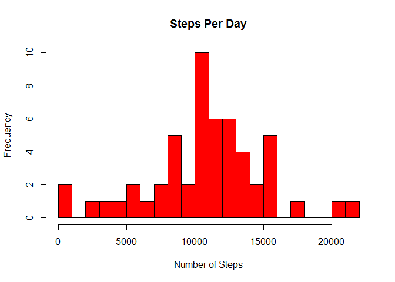
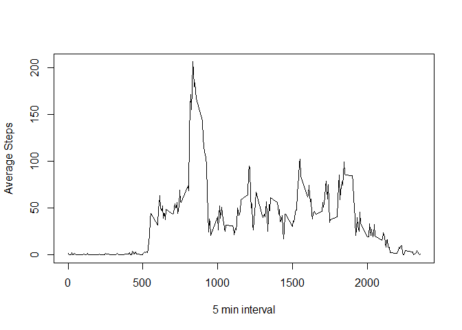
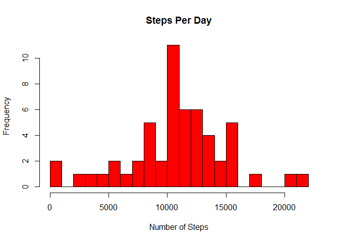
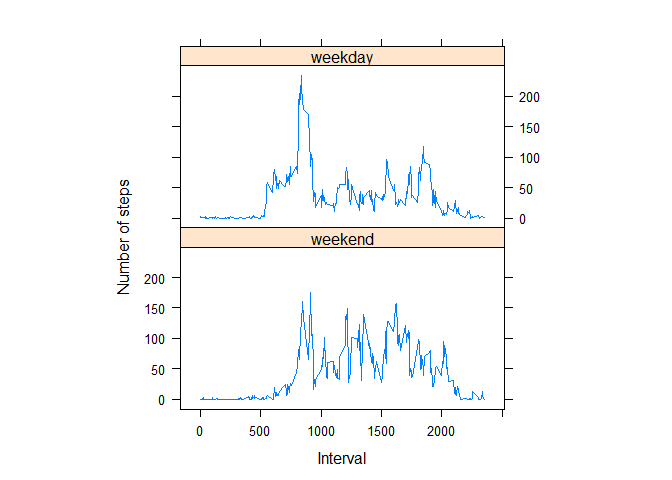

# Reproducible Research: Peer Assessment 1


## Loading and preprocessing the data

```r
unzip("activity.zip")
stepsData <- read.csv("activity.csv")
stepsData$date <- as.Date(stepsData$date, format="%Y-%m-%d")
```


## What is mean total number of steps taken per day?

```r
sumStepsDays <- aggregate(. ~ date, stepsData, sum)

hist(sumStepsDays$steps, breaks=25, col="red", xlab="Number of Steps", main="Steps Per Day")
```

 

```r
meanSteps <- mean(sumStepsDays$steps)
medianSteps <- median(sumStepsDays$steps)
```
The mean total number of steps is 1.0766189\times 10^{4} and the median total number of steps is 10765.  


## What is the average daily activity pattern?

```r
avDailySteps <- aggregate(stepsData$steps, list(stepsData$interval), mean, na.rm=TRUE)
###change the column names because Group.1 and x gets confusing
colnames(avDailySteps)<- c("interval", "mean")

maxAverageSteps <- max(avDailySteps$mean)
maxInterval <- avDailySteps[avDailySteps$mean==maxAverageSteps,1]
plot(avDailySteps$interval, avDailySteps$mean, type="l", xlab="5 min interval", ylab="Average Steps")
```

 
  
  The 5 minute interval that contains the most steps on average accross all days is 835. The max number of steps is 206.1698113.  

## Imputing missing values

```r
###using the average per interval that we already have to fill in the missing values.
missingValCount <- sum(is.na(stepsData$steps))
completeStepsData <- stepsData
row.names(avDailySteps) <- avDailySteps$interval
naRows <- which(is.na(completeStepsData$steps))
completeStepsData$steps[naRows] <- avDailySteps[naRows,"mean"]

completeStepsPerDay <- aggregate(. ~ date, completeStepsData, sum)
hist(completeStepsPerDay$steps, breaks=25, col="red", xlab="Number of Steps", main="Steps Per Day")
```

 

```r
cmpMeanSteps <- mean(completeStepsPerDay$steps)
cmpMedianSteps <- median(completeStepsPerDay$steps)
```
The total number of missing values is 2304.  

The mean total number of steps after replacing the NA values with the average for that interval is 1.0766189\times 10^{4} and the median total number of steps is 1.0765594\times 10^{4}.  


## Are there differences in activity patterns between weekdays and weekends?

```r
completeStepsData$day <- ifelse(weekdays(completeStepsData$date) %in% c("Saturday", "Sunday"), "weekend", "weekday")
completeStepsData$day <- factor(completeStepsData$day, levels=c("weekend", "weekday"))

wAvSteps <- aggregate(steps ~ interval + day, completeStepsData, mean)
library(lattice)
xyplot(steps ~ interval | factor(day), wAvSteps,type="l", aspect=1/2, ylab="Number of steps", xlab="Interval")
```

 
